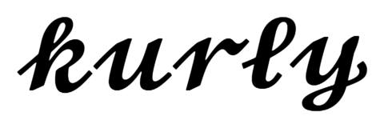

# kurly <sub><sup>2.0.0-beta.1</sup></sub>



### Tiny pluggable templating engine for Node and browsers

[](https://npmjs.com/package/kurly)
[](https://opensource.org/licenses/MIT)
[](https://travis-ci.org/Download/kurly)


<sup><sub><sup><sub>.</sub></sup></sub></sup>


`kurly` is a tiny ~[1006](#gzip-size) bytes pluggable templating engine for
Node and browsers. It can parse templates with tags to abstract syntax trees,
which it can then compile into functions.


## Download

* [kurly.js](https://unpkg.com/kurly@2.0.0-beta.1/kurly.js)
  (fully commented source ~7kB)
* [kurly.min.js](https://unpkg.com/kurly@2.0.0-beta.1/kurly.min.js)
  (~[1006](#gzip-size) bytes minified and gzipped)


## CDN

*index.html*
```html
<script src="https://unpkg.com/kurly@2.0.0-beta.1/kurly.min.js"></script>
<script>(function(){ // IIFE
  var ast = kurly.parse('{noun} {verb} {adjective}!')
  var tags = { '*': ({name}) => (rec) => `${rec[name]}` }
  var template = kurly.compile(ast, tags)
  var record = { noun: 'Kurly', verb: 'is', adjective: 'easy' }
  var output = template(record)  // ['Kurly', ' ', 'is', ' ', 'easy', '!']
  console.info(output.join('')) // > "Kurly is easy!"
})()</script>
```


## Install

```sh
npm install --save kurly
```


## Require

```js
// main functions
var parse = require('kurly/parse')
var compile = require('kurly/compile')
// extra utils
var pipe = require('kurly/pipe')
var tag = require('kurly/tag')

```


## Import

```js
// main functions
import parse from 'kurly/parse'
import compile from 'kurly/compile'
// extra utils
import pipe from 'kurly/pipe'
import tag from 'kurly/tag'
```


## Use

Call [`parse`](#parse) to parse text with tags into an abstract syntax tree:

```js
var ast = parse('Hello, {kurly}')
```

Create [tags](#tags):

```js
var tags = {
  kurly: function(ctx){
    return function(rec) {
      return `${rec.planet}!`
    }
  }
}
```

Call [`compile`](#compile) with the ast and your tags to create a template function:

```js
var template = compile(ast, tags)
```

Call the resulting function, passing it a record with parameters:

```js
var result = template({ planet: 'World' }) // ['Hello, ', 'World!']
```

## `parse`

The kurly parser is nice because it's small but powerful. It handles nesting and performs escaping and it returns an ast that is fully serializable and from which you can reconstruct the input string.

```ts
function parse(str: string, options?: Options): Ast
```

### `parse`(`str`: `string`, `options`?: [`Options`](#options)): [`Ast`](#ast)`

Parses the string `str` to an [`Ast`](#ast).

If parse `options` are given` they are used to determine
whether open/close markers are optional and which characters
to use for them. By default `{` and `}` are required.

#### `str`: `string`
The string to parse

#### `options`: [`Options`](#Options)
Optional parse options.


## `Options`

Pass options to [`parse`](#parse) to control it's behavior.

```ts
type Options = {

  /**
   * Whether open/close markers are optional
   */
  optional?: boolean,

  /**
   * The character to use as open marker
   */
  open?: string,

  /**
   * The character to use as close marker
   */
  close?: string
}
```


## `Ast`

An Abstract Syntax Tree. An array of strings or [`Node`](#node)s, where a `Node`
has a field `ast` that contains the ast of it's children.

```ts
type Ast = Array<Node | string>
```

[`parse`](#parse) returns an `Ast` and [`compile`](#compile) accepts an `Ast`.


## `compile`

Compiles an ast into a template function.

```ts
function compile(ast: Ast, tags: Tags, rec?: object): TagFn
```

### `compile`(`ast`: [`Ast`](#ast), `tags`: [`Tags`](#tags), `rec`?: `object`): [`TagFn`](#tagfn)

This function will create a pipe from the `ast` and `tags`
by calling [`pipe()`](#pipe), and then will create a single
function from it by calling [`tag()`](#tag), and return that.

#### `ast`: [`Ast`](#ast)
The ast to compile into a function

#### `tags`: [`Tags`](#tags)
The tags to use in the compile

#### `rec`?: object
The optional static record object.


## `Tags`
`kurly` is just a tiny parser / compiler. Any functionality should be
provided by tags.

You provide the tags to use to [`compile`](#compile) or [`pipe`](#pipe)
in the form of a dictionary object where each key's name is a `string`
to match tag names to and each key's value is a [`Tag`](#tag).

```ts
type Tags = {
  [key : string]: Tag;
}
```
One special entry is the [wildcard tag](#wildcard-tag) which has key name `'*'`.


## Tag syntax

`kurly` matches tags following a variation of this regex pattern:

```js
/({)([_a-zA-Z][_a-zA-Z0-9]*)([^_a-zA-Z0-9\}].*)?(})/
```

This expression matches an open curly brace, a tag name, optionally some
text starting with a non-identifier character and a closing curly brace.

Tag names can not contain any special characters such as punctuation,
diacritics, whitespace, unicode symbols etc. They must start with an uppercase
or lowercase letter or the underscore and may be followed by zero or more
alphanumerical characters.

If a tag is enclosed in braces, any text following the tag name is parsed and
escaping is applied. A tag can contain a closing brace as text by escaping it.
The string `"a {tag with a closing curly brace \} in it}"` will be parsed
correctly.

If a tag is not enclosed in braces, it's text ends at the first whitespace
character following the tag name.

Kurly's `parse` function accepts an `options` object to control whether
open and close braces are optional and which characters are used for them.


## Creating tags

To create a kurly tag, we create a *higher order function*; a function that
returns a function:

```js
function outer(cfg) {
  return function inner(rec) {
    return `My first ${rec.thing}`
  }
}
```

**The outer function** is called during the compilation phase.
It is passed a configuration object containing the tag name and function,
the tag content text and an abstract syntax tree of it's children
(see [Nested tags](#nested-tags)).
Any expensive work that needs to be done only once can be done here.

**The inner function** is called during the render phase.
It returns an (array of) output(s). The output entries can be any type. It's
argument is a record object that was initialized when the compiled function was
called. One key is always added to this object: `children`. This contains the
rendered output of the children and can be used in the tag output.


## Share your tags

Created a nice tag and want to share it with the world?
Publish it to NPM! Make sure to include the keyword `"kurly"` in your
`package,json` so it will show up in the list of
[projects related to kurly](https://www.npmjs.com/search?q=keywords:kurly).


## Static tags

Since v2, Kurly supports 'static' tags. These are tags that don't depend on the
record object passed to the template function. Instead, they get access to a static
version of that object at compile time. To create a static tag we write:

```js
function outer(cfg, rec) {
  return function inner() {
    return `My first ${rec.thing}`
  }
}
```

Notice how the `rec` parameter has moved from the inner to the outer function.

If any of the tags in an ast are not static, all static tags will be converted
to dynamic tags automatically. The reverse is not possible.

If all tags in an ast are static and a static record object is passed to
`compile`, it will yield a function that can be called without arguments.

Static tags are more restricted in their abilities, but they can exist in both
static and dynamic ast's, so they are the most flexible option if your tag does
not need to access any field from the dynamic record.


## Nested tags

Kurly supports nested tags:

```js
var ast = parse('{greeting, {kurly}}')
var template = compile(ast, {
  greeting: () => ({ children }) => ['Hello'].concat(children),
  kurly: () => () => 'World!'
})
var result = template() // ['Hello', ', ', 'World!']
```

For a tag to support nesting, it should pick up it's children and add them
to the result it is returning. In the example above, `greeting` is adding
it's children to the array it is returning using `concat`.

Static tags can also allow nesting, but because they don't have access
to the dynamic record, they need to do a little bit more work for it.
Fortunately, [`children`](#children) does that work for us:

```js
var children = require('kurly/children')
var ast = parse('{greeting, {kurly}}')
var template = compile(ast, {
  greeting: (ctx, rec) => () => ['Hello'].concat(children(ctx, rec)),
  kurly: () => () => 'World!'
})
var result = template() // ['Hello', ', ', 'World!']
```

`children()` is written in such a way, that it can be used both
from static and dynamic tags alike:

```js
var children = require('kurly/children')
var ast = parse('{greeting, {kurly}}')
var template = compile(ast, {
  greeting: (ctx) => (rec) => ['Hello'].concat(children(ctx, rec)),
  kurly: () => () => 'World!'
})
var result = template() // ['Hello', ', ', 'World!']
```


## Wildcard tag

You can register a wildcard / catch-all tag under the name `'*'` that will
be called for everything that matches the tag syntax, but for which no
registered tag was found:

```js
var ast = parse('{a}, {b}, {c}.')
var catchAll = ({name}) => ({greet}) => `${greet} ${name}`
var template = compile(ast, { '*': catchAll })
var result = template({ greet: 'Hi' })
// result: ['Hi a', ', ', 'Hi b', ', ', 'Hi c', '.']
```


## Tag return value

A tag may return just about anything. Eventually, all the return values of
all the tags will end up in a flattened array, which is returned by the
template function, together with all the unmatched text, in the right order.

If you need the end result to be a string and all your tags are returning
(arrays of) strings, you can convert the template result to a string like
this:

```js
result = result.join('')
```


## `Tag`
Tags come in two flavours: dynamic tags, which have access to the dynamic record object
that is passed to the template function returned by `compile`, and static tags, which don't need / have access to the dynamic record, but instead only have access to a static version of that record.

```ts
type Tag = DynamicTag | StaticTag
```

With `tag`, you can 'upgrade' a `Node` to a `PipeNode`:

```ts
function tag(pipe: Pipe, rec?: object, parent?: TagFn): TagFn
```

### `tag`(`pipe`: [`Pipe`](#pipe), `rec`?: `object`, `parent`?: [`TagFn`](#tagfn))

Compiles a `Pipe` into a single `TagFn`

#### `pipe`: [`Pipe`](#pipe)
The pipe to compile

#### `rec`?: `object`
Optional static record object

#### `parent`?: `TagFn`
Optional parent `TagFn`


## `DynamicTag`

A function that accepts an ast [`Node`](#node) and returns a dynamic tag function.

```ts
type DynamicTag = (ctx: Node) => DynamicTagFn
```

## `StaticTag`

A function that accepts an ast [`Node`](#node) and an optional static
record object and returns a [static tag function](#static-tags).

```ts
type StaticTag = (ctx: Node, rec?: object) => StaticTagFn
```

## `TagFn`

`kurly` parses and finds tags during the `parse` phase and builds
an ast. Then during `compile` it replaces the tags it found in the
ast with the tag functions it was given.

These tag functions are either static or dynamic tag functions.
[`DynamicTag`](#dynamictag)s return a [`DynamicTagFn`](#dynamictagfn)
and [`StaticTag`](#statictag)s return a [`StaticTagFn`](#statictagfn).

```ts
export type TagFn = DynamicTagFn | StaticTagFn
```

## `DynamicTagFn`

A function that accepts a dynamic record object and returns some output.

```ts
type DynamicTagFn = (rec: object) => any
```

## `StaticTagFn`

A function that accepts no arguments and optionally uses a static record
object in it's output only.

```ts
type StaticTagFn = () => any
```

## `Node`

Represents a possible tag. It includes fields to store the tag
`open` marker, it's `name`, any `sep` whitespace, the tag content
`text`, the `close` marker and a parsed `ast` of it's content text.

```ts
interface Node extends Object {
  open: string,
  name: string,
  sep: string,
  text: string,
  close: string,
  ast: Ast,
}
```

See also: [`Ast`](#ast)

## `PipeNode`

A node that is 'instantiated'. That is, a `Tag` was found that matched
it's name (or a wildcard tag was found) and that tag was invoked to
create a [`TagFn`](#tagfn), stored in property `tag` on the node.

```js
interface PipeNode extends Node {
  tag: TagFn,
}
```

## `Pipe`

An 'instantiated' [`Ast`](#ast), where all nodes have a populated `tag` field.

```ts
type Pipe = Array<PipeNode | string>
```

Use `pipe()` to create pipes:

```ts
function pipe(ast: Ast, tags: Tags, rec?: object): Pipe
```

### `pipe`(`ast`: [`Ast`](#ast), `tags`: [`Tags`](#tags), `rec`?: `object`): `Pipe`

Creates a `Pipe` from an ast.

Instead of using [`compile`](#compile), to compile an ast directly
into a [`TagFn`](#tagfn), you can use `pipe` to create
a [`Pipe`](#pipe), which is an array of strings or [`PipeNode`](#pipenode)s.
You can then call `tag()` on that pipe to get basically the same result as
you would have gotten from `compile()`, or you can choose to do something
else entirely with that pipe.

#### `ast`: [`Ast`](#ast)
The ast to create a `Pipe` from.

#### `tags`: [`Tags`](#tags)
The tags to use in the `Pipe`.

#### `rec`?: `object`
Optional static record object


## Issues

Add an issue in the [issue tracker](https://github.com/download/kurly/issues)
to let me know of any problems you find, or questions you may have.


## Copyright

Copyright 2021 by [Stijn de Witt](https://stijndewitt.com).


## License

Licensed under the [MIT](https://opensource.org/licenses/MIT) Open Source license.


## gzip-size

The GZIP algorithm is available in different flavours and with different
possible compression settings. The sizes quoted in this README have been
measured using [gzip-size](https://npmjs.com/package/gzip-size)
by [Sindre Sorhus](https://github.com/sindresorhus), your mileage may vary.
